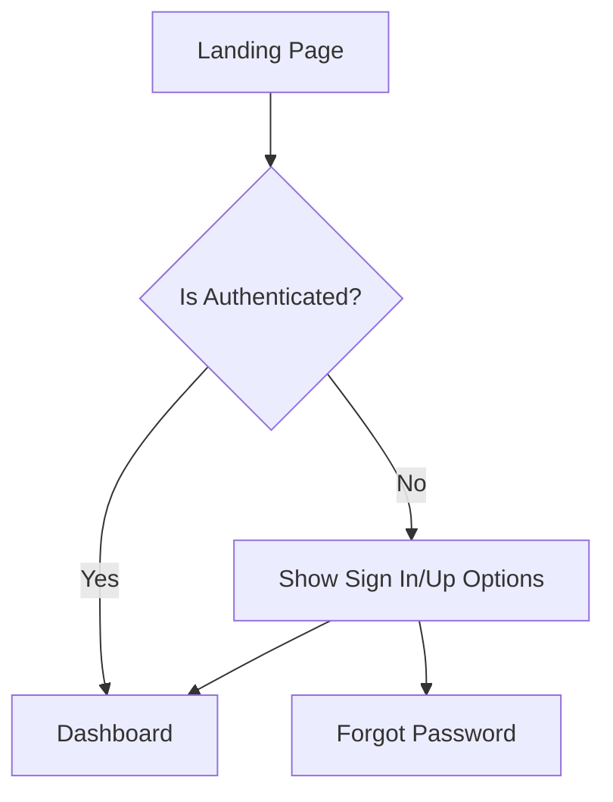
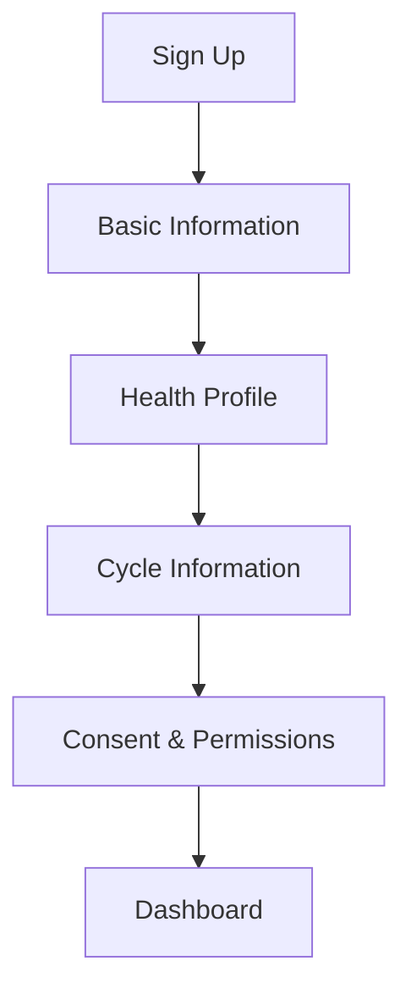
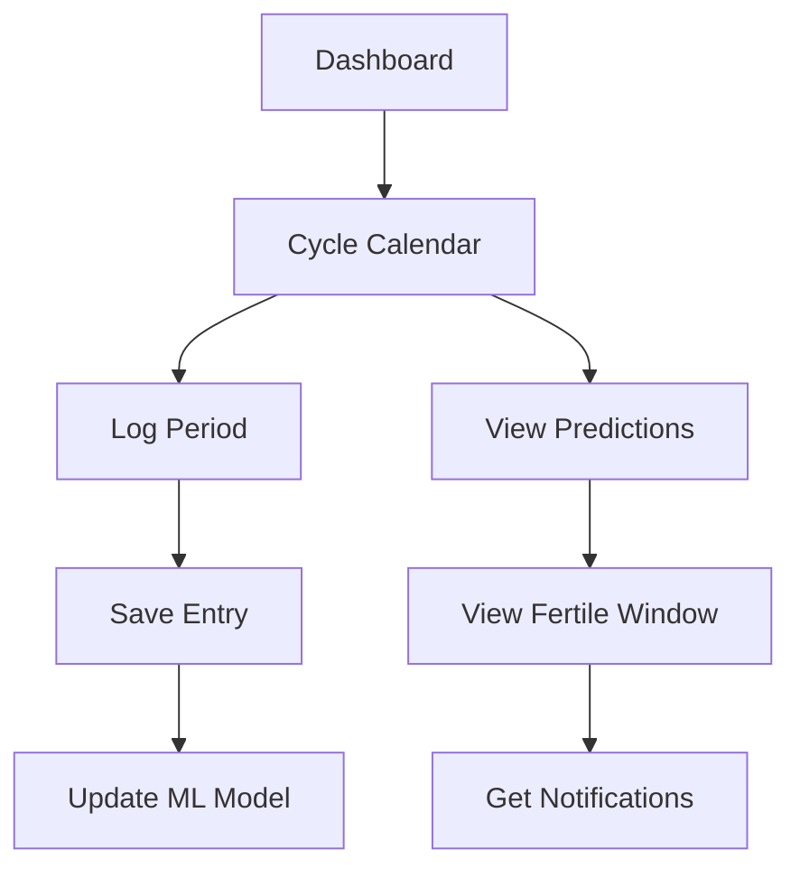
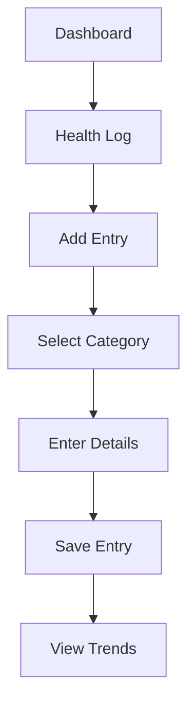
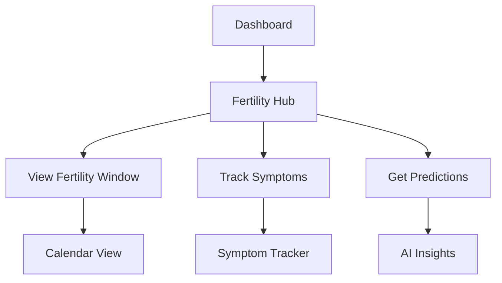

# Auralie - User Flow Documentation

## 🚀 Application Overview
Auralie is a women's health application with the following core features:
- **Cycle Tracking**: Predict and track menstrual cycles
- **Health Log**: Record and monitor health metrics and symptoms
- **Fertility Insights**: Provide fertility predictions and insights
- **Educational Content**: Offer health-related educational materials

## 🔄 System Architecture
- **Frontend**: Next.js (React)
- **Backend**: Python (FastAPI)
- **Authentication**: Firebase Authentication
- **Database**: Firebase Realtime Database
- **AI/ML**: Google Gemini for predictions and insights

## 👥 User Flow

### 1. Authentication Flow

### 2. Onboarding Flow

### 3. Core Feature Flows

#### 3.1 Cycle Tracking

#### 3.2 Health Log

#### 3.3 Fertility Insights

## 🔄 Data Flow

### 1. Authentication
- Firebase Authentication handles user signup/login
- JWT tokens for session management
- Role-based access control

### 2. Data Collection
- User inputs (cycle data, symptoms, health metrics)
- Automated tracking (if integrated with wearables)
- Background data processing

### 3. AI/ML Integration
- Gemini AI processes user data
- Generates predictions and insights
- Personalizes content based on user history

## 📱 Screens & Components

### 1. Authentication
- Login/Signup forms
- Password recovery
- Social auth options

### 2. Dashboard
- Overview cards
- Quick actions
- Notifications

### 3. Cycle Tracking
- Calendar view
- Log entry form
- Prediction display

### 4. Health Log
- Symptom tracker
- Mood/energy levels
- Custom metrics

### 5. Fertility Hub
- Fertility calendar
- Symptom correlation
- AI-powered insights

## 🔄 API Endpoints

### Authentication
- `POST /api/auth/signup` - User registration
- `POST /api/auth/login` - User login
- `POST /api/auth/refresh` - Refresh token

### Cycle Tracking
- `GET /api/cycle` - Get cycle data
- `POST /api/cycle` - Log cycle data
- `GET /api/cycle/predict` - Get predictions

### Health Log
- `POST /api/health/log` - Add health entry
- `GET /api/health/summary` - Get health summary
- `GET /api/health/trends` - Get health trends

### Fertility
- `GET /api/fertility/window` - Get fertility window
- `GET /api/fertility/insights` - Get AI insights

## 🔒 Security & Privacy

### Data Protection
- End-to-end encryption for sensitive data
- Regular security audits
- Data minimization principles

### User Privacy
- Granular data sharing controls
- Clear privacy policy
- Data export/delete options

## 🚀 Next Steps

1. **Immediate**:
   - Implement core authentication flow
   - Set up basic dashboard
   - Create cycle tracking UI

2. **Short-term**:
   - Integrate Gemini AI
   - Implement health logging
   - Add basic analytics

3. **Long-term**:
   - Advanced AI predictions
   - Community features
   - Wearable device integration

## 📝 Notes
- Ensure all health data is handled with care and complies with relevant regulations (HIPAA, GDPR, etc.)
- Implement proper error handling and user feedback
- Consider adding offline support for better user experience
- Plan for scalability as user base grows
