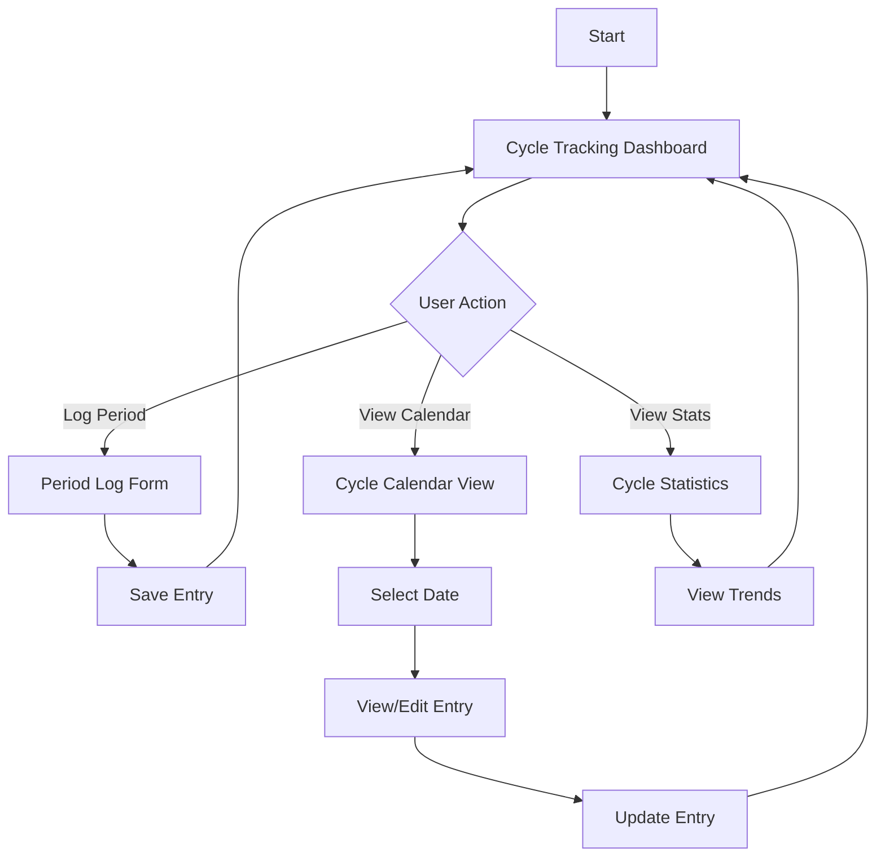
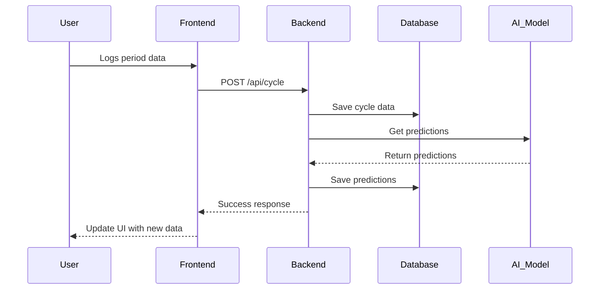

# Cycle Tracking - User Flow

## Overview
This document outlines the user flow for the Cycle Tracking feature in Auralie, helping users track their menstrual cycles, log symptoms, and receive predictions.

## User Flow Diagram

## Detailed User Flows

### 1. Logging Menstrual Cycle
1. User navigates to Cycle Tracking
2. Clicks "Log Period" button
3. Fills out period details:
   - Start date
   - Flow intensity
   - Symptoms
   - Mood
   - Notes (optional)
4. Submits the form
5. System updates cycle data and predictions

### 2. Viewing Cycle History
1. User navigates to Cycle Tracking
2. Scrolls through calendar view
3. Clicks on a specific date to view details
4. Views logged information
5. Option to edit or delete entry

### 3. Updating Cycle Information
1. User selects a date with existing entry
2. Clicks "Edit" button
3. Updates the relevant information
4. Clicks "Save Changes"
5. System updates the entry and recalculates predictions if needed

### 4. Viewing Predictions
1. User navigates to Cycle Tracking
2. Views predicted period dates
3. Views fertile window (if applicable)
4. Views ovulation prediction
5. Can set up notifications for upcoming events

### 5. Setting Up Notifications
1. User navigates to Settings
2. Selects "Cycle Notifications"
3. Chooses notification types:
   - Period start reminder
   - Fertile window alert
   - Ovulation reminder
4. Sets preferred notification time
5. Saves preferences

## Data Flow

## Key Components

1. **Cycle Calendar**
   - Monthly view with period days highlighted
   - Color-coded indicators for different cycle phases
   - Quick add buttons

2. **Period Log Form**
   - Date picker
   - Flow intensity selector
   - Symptom checklist
   - Mood tracker
   - Notes field

3. **Cycle Statistics**
   - Average cycle length
   - Period duration
   - Symptom frequency
   - Predictions accuracy

4. **Prediction Display**
   - Next period prediction
   - Fertile window
   - Ovulation day
   - Confidence indicators

## API Endpoints

### Cycle Data
- `GET /api/cycle` - Get user's cycle history
- `POST /api/cycle` - Log new cycle data
- `PUT /api/cycle/:id` - Update cycle entry
- `DELETE /api/cycle/:id` - Delete cycle entry

### Predictions
- `GET /api/cycle/predictions` - Get cycle predictions
- `GET /api/cycle/fertility` - Get fertility window

## Error Handling

### Common Errors
1. **Missing Data**
   - Show helpful message about required fields
   - Highlight missing fields
   
2. **Invalid Date Range**
   - Validate date ranges
   - Show appropriate error message
   
3. **Server Errors**
   - Show user-friendly error message
   - Log detailed error for debugging
   - Provide retry option

## Edge Cases

1. **Irregular Cycles**
   - Handle varying cycle lengths
   - Provide appropriate messaging
   
2. **First-Time Users**
   - Guide through initial setup
   - Explain how predictions improve over time
   
3. **Data Gaps**
   - Handle missing historical data
   - Allow manual entry of past cycles

## Future Enhancements

1. **Integration with Health Apps**
   - Sync with Apple Health/Google Fit
   - Import historical data
   
2. **Advanced Analytics**
   - Long-term cycle trends
   - Correlation with lifestyle factors
   
3. **Community Features**
   - Anonymous cycle pattern comparison
   - Community insights

---
*Last Updated: October 29, 2025*
